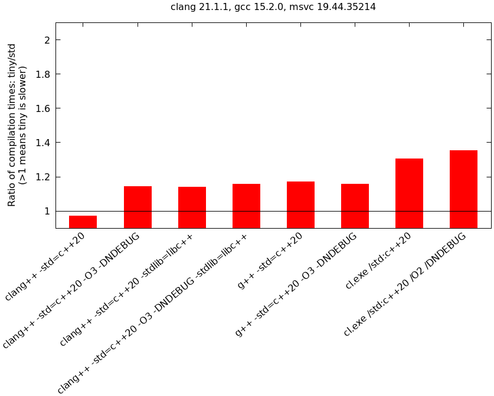

# tiny::optional  <!-- omit in toc -->


- [Introduction](#introduction)
- [Motivation](#motivation)
  - [Use case 1: Wasting no memory](#use-case-1-wasting-no-memory)
  - [Use case 2: Using sentinel values](#use-case-2-using-sentinel-values)
- [Requirements](#requirements)
- [Limitations](#limitations)
  - [Platform specific behavior](#platform-specific-behavior)
  - [Compatibility with `std::optional`](#compatibility-with-stdoptional)
- [Installation](#installation)
  - [Installation using cmake](#installation-using-cmake)
  - [Manual installation](#manual-installation)
  - [Preprocessor flags](#preprocessor-flags)
  - [Compatibility between different versions](#compatibility-between-different-versions)
  - [Natvis](#natvis)
- [Usage](#usage)
  - [Using `tiny::optional` as `std::optional` replacement](#using-tinyoptional-as-stdoptional-replacement)
  - [Using a sentinel value](#using-a-sentinel-value)
  - [Storing the empty state in a member variable](#storing-the-empty-state-in-a-member-variable)
  - [The full signature of `tiny::optional`](#the-full-signature-of-tinyoptional)
  - [Available non-member definitions](#available-non-member-definitions)
  - [Helpers to distinguish types at compile-time (metaprogramming)](#helpers-to-distinguish-types-at-compile-time-metaprogramming)
  - [Specifying a sentinel value via a type](#specifying-a-sentinel-value-via-a-type)
  - [An optional type with automatic sentinels for integers and guarantee of in-place](#an-optional-type-with-automatic-sentinels-for-integers-and-guarantee-of-in-place)
  - [Teaching `tiny::optional` about custom types (`tiny::optional_flag_manipulator`)](#teaching-tinyoptional-about-custom-types-tinyoptional_flag_manipulator)
    - [Introduction](#introduction-1)
    - [Example for `tiny::optional_flag_manipulator`](#example-for-tinyoptional_flag_manipulator)
    - [Details](#details)
    - [Storing the empty flag in only part of the payload](#storing-the-empty-flag-in-only-part-of-the-payload)
    - [A warning about exploiting padding bytes](#a-warning-about-exploiting-padding-bytes)
    - [Enumerations](#enumerations)
    - [Types that you have not authored](#types-that-you-have-not-authored)
      - [Generic alternative](#generic-alternative)
      - [Alternative for `static constexpr`](#alternative-for-static-constexpr)
  - [Disabling platform specific tricks (`TINY_OPTIONAL_USE_SEPARATE_BOOL_INSTEAD_OF_UB_TRICKS`)](#disabling-platform-specific-tricks-tiny_optional_use_separate_bool_instead_of_ub_tricks)
- [Performance results](#performance-results)
  - [Runtime](#runtime)
  - [Build time](#build-time)
- [How the library exploits platform specific behavior](#how-the-library-exploits-platform-specific-behavior)
- [Related work](#related-work)


# Introduction
The goal of this library is to provide the functionality of [`std::optional`](https://en.cppreference.com/w/cpp/utility/optional) while not wasting any memory unnecessarily for 
1. types with unused bits (currently `double`, `float`, `bool`, raw pointers; note that NaNs, `nullptr` etc. are still valid non-empty values!), or
2. custom types with unused states, or 
3. where a specific programmer-defined sentinel value should be used (e.g., an optional of `int` where the value `0` should indicate "no value").

> ⚠️ **Warning:** This library exploits undefined/platform specific behavior on x86/x64 architectures to implement the first case. However, this first case can be disabled to allow using the second and third cases also on other architectures. See chapter "[Disabling platform specific tricks (`TINY_OPTIONAL_USE_SEPARATE_BOOL_INSTEAD_OF_UB_TRICKS`)](#disabling-platform-specific-tricks-tiny_optional_use_separate_bool_instead_of_ub_tricks)" for more details.

For a quick start, see the following example, also available [live on godbolt](https://godbolt.org/z/83xo9hdxT):
```C++
//--------- Automatic exploitation of unused bit patterns ---------
// Assume you have the following optional variable:
std::optional<double> stdOptional;

// The size of it is 16 bytes due to padding; 7 bytes are wasted:
static_assert(sizeof(stdOptional) == 16);

// Replacing std::optional with tiny::optional does not waste space:
tiny::optional<double> tinyOptional;
static_assert(sizeof(tinyOptional) == 8);

// This works automatically for bool, float, double and raw pointers.


//--------- Usage of sentinel values ---------
// But what about other types, such as integers? If you know that not the 
// whole value range is used, you can instruct the library to exploit this.
// For example, assume you have an optional index into e.g. some array:
std::optional<int> stdIndex;
// which has a size of 8 bytes due to padding:
static_assert(sizeof(stdIndex) == 8);

// Assume you know that negative values can never occur. Then you can instruct
// the library to use e.g. -1 as "sentinel" and save half the memory:
tiny::optional<int, -1> tinyIndex;
static_assert(sizeof(tinyIndex) == 4);
// This is more expressive and safe than using a raw variable with a comment:
int poorMansTinyIndex = -1; // -1 value indicates emptiness

// Of course, attempting to store the value -1 in tinyIndex is an error
// and actually triggers an assertion (if not compiled with NDEBUG):
//    tinyIndex = -1; // Uncomment to trigger assert

// Note that without such a user supplied sentinel value, the optional is 
// not "tiny", because in principle the whole value range could be used:
static_assert(sizeof(tiny::optional<int>) == sizeof(std::optional<int>));

// You can also instruct the library to use a member variable of the
// contained type to store the information about the empty state. See below.
```


# Motivation
## Use case 1: Wasting no memory
`std::optional` always uses a separate `bool` member to store the information if a value is set or not. A `bool` always has a size of at least 1 byte, and often implies several padding bytes afterwards. For example, a `double` has a size of 8 bytes.
A `std::optional<double>` typically has a size of 16 bytes because the compiler inserts 7 padding bytes after the internal `bool`.
But for several types this is unnecessary because they have unused bit patterns.
Therefore, `std::optional` often just wastes memory and is not very cache-friendly.
This library exploits these **unused** bit patterns to store the information if a value is set or not in-place within the payload itself, **without** loosing any "valid" values.
To emphasize this:
* `sizeof(tiny::optional<bool>) == sizeof(bool)`, and both `true` and `false` can be stored.
* `sizeof(tiny::optional<double>) == sizeof(double)`, and all "normal" values of `double` remain valid and can be stored in the `tiny::optional` without the optional becoming empty. This includes `std::numeric_limits<double>::quiet_NaN()` and `std::numeric_limits<double>::signaling_NaN()`, and of course infinities, subnormals, max. and lowest values, etc. Similar for `float`.
* `sizeof(tiny::optional<Foo*>) == sizeof(Foo*)`; storing a `nullptr` results in a **non-empty** optional, so `nullptr` remains a valid value and is distinct from an empty optional!

See the end of the readme for details on how the library achieves this.

`tiny::optional` can also be "taught" how it may store a custom payload type with an unused state without requiring an additional internal `bool`. See the chapter about `tiny::optional_flag_manipulator`.

The results below show that in memory bound applications this can result in a significant performance improvement.
This optimization is similar to what Rust is doing for [booleans](https://stackoverflow.com/a/73181003/3740047) and [references](https://stackoverflow.com/a/16515488/3740047).

**Note:** The built-in exploitation of unused bit patterns is available only on x86/x64.
If you try to compile the library on any other platform you get a compiler error.
To allow the following use cases on other platforms, you can disable the platform specific tricks as explained in the chapter "[Disabling platform specific tricks (`TINY_OPTIONAL_USE_SEPARATE_BOOL_INSTEAD_OF_UB_TRICKS`)](#disabling-platform-specific-tricks-tiny_optional_use_separate_bool_instead_of_ub_tricks)".


## Use case 2: Using sentinel values
Sometimes one wants to use special "sentinel" or "flag" values to indicate that a certain variable does not contain any information. Think about a raw integer `int index` that stores an index into some array and where the special value `-1` should indicate that the index does not refer to anything. Looking at such a variable, it is not immediately clear that it can have such a special "empty" state. This makes code harder to understand and might introduce subtle bugs. 

The present library can be used to provide more semantics: `tiny::optional<int, -1>` immediately tells the reader that the variable might be empty, and that the "sentinel" `-1` must not be within the set of valid values. At the same time, it does not waste additional memory (i.e. `sizeof(tiny::optional<int, -1>) == sizeof(int)`), in contrast to `std::optional<int>`.

Note: In contrast to the first use case, the sentinel value is "removed" from the range of valid values of the type.
So `-1` cannot be stored in `tiny::optional<int, -1>`.


# Requirements
Besides the C++ standard library, there are no external dependencies.
The library requires at least C++17. The monadic operations `and_then()` and `transform()` are always defined (although the C++ standard introduced them starting only with C++23). When C++20 is enabled, the three-way comparison operator `operator<=>()` and the monadic operation `or_else()` are additionally implemented, and copy/move constructors/assignment operators are [trivial if possible](#compatibility-with-stdoptional).

The full functionality of the library is supported only on **x64 and x86** architectures on Windows, Linux and Mac.
By disabling tricks relying on undefined behavior, as explained in "[Disabling platform specific tricks (`TINY_OPTIONAL_USE_SEPARATE_BOOL_INSTEAD_OF_UB_TRICKS`)](#disabling-platform-specific-tricks-tiny_optional_use_separate_bool_instead_of_ub_tricks)", any standard conforming platform should work.

The library is regularly tested on MSVC, clang and gcc on Windows, Linux and Mac (see the github actions).


# Limitations

## Platform specific behavior
This library exploits **platform specific behavior** (i.e. undefined behavior). So if your own code also uses platform specific tricks, you might want to check that they are not incompatible. Compare the section below where the tricks employed by this library are explained. 

Note that you can disable them by defining `TINY_OPTIONAL_USE_SEPARATE_BOOL_INSTEAD_OF_UB_TRICKS`, as explained in the chapter "[Disabling platform specific tricks (`TINY_OPTIONAL_USE_SEPARATE_BOOL_INSTEAD_OF_UB_TRICKS`)](#disabling-platform-specific-tricks-tiny_optional_use_separate_bool_instead_of_ub_tricks)".


## Compatibility with `std::optional`
Currently, the following components of the interface of `std::optional` are not yet supported:
* No converting constructors and assignment operators are implemented. The major issue here is to decide what to do with conversions such as `tiny::optional<int, -1>` to `tiny::optional<unsigned, 42>`: What if the source contains a `42`? Should an exception be thrown? Should this be asserted in debug? Should this specific conversion be forbidden?
* Triviality of special member functions (*roughly* speaking, triviality means that they are compiler generated and that all members have compiler generated functions; this allows for some additional optimizations):
  * In C++17: Copy/move constructors, copy/move assignment operators and destructors are never trivial, even if the payload type `T` of `tiny::optional<T>` would allow it. So this is a deviation from `std::optional`. It was not implemented for simplicity. It would require a lot of additional boilerplate code.
  * In C++20 and later, copy/move constructors, copy/move assignment operators and destructors of `tiny::optional` are trivial under the same conditions as for `std::optional`. So we fully follow the standard in C++20.
  * Note: Versions before clang 15 never have trivial special member functions, even in C++20, because [of a bug in clang](https://github.com/llvm/llvm-project/issues/45614). Clang 15 and later (and all versions of gcc and MSVC) are fine.
* Methods and types are not `constexpr`. This will probably not be possible in C++17 because some of the tricks rely on `std::memcpy`, which is not `constexpr`. `std::bit_cast` might help here for C++20. Since the whole purpose of the library is to safe memory during runtime, a viable workaround is to simply use `std::optional` in `consteval` contexts.

Moreover, the monadic operation `transform()` always returns a `tiny::optional<T>`, i.e. specification of a sentinel or some other optional as return type (`tiny::optional_sentinel_via_type` etc.) is not possible. As a workaround, you can use `and_then()`.


# Installation

This is a **header-only** library.

## Installation using cmake

Via [`find_package`](https://cmake.org/cmake/help/latest/command/find_package.html) (recommended):
1. Clone or download the `tiny-optional` repository.
1. In its root directory, execute 
   ```sh
   cmake -B build
   sudo cmake --install build
   ```
   to generate the files in the folder `build` and then install them to the default location (e.g. `/usr/local/` on linux, `C:\Program Files` on Windows).
   Alternatively, to install into some custom directory:
   ```sh
   cmake -B build -DCMAKE_INSTALL_PREFIX="/path/to/custom/tiny/optional/install/dir"
   cmake --install build
   ```
1. In your own project's CMakeLists.txt, add:
   ```cmake
   find_package(tiny-optional CONFIG REQUIRED)
   target_link_libraries(<target> PRIVATE tiny-optional::tiny-optional)
   ```
   where `<target>` is the cmake target that uses the library.
   If you had installed the library in a custom location, you need tell cmake about it, e.g. via [`CMAKE_PREFIX_PATH`](https://cmake.org/cmake/help/latest/variable/CMAKE_PREFIX_PATH.html) (for example, run cmake as `cmake <path> -DCMAKE_PREFIX_PATH="/path/to/custom/tiny/optional/install/dir"`).


Alternative via [`add_subdirectory`](https://cmake.org/cmake/help/latest/command/add_subdirectory.html):
1. Put all files of the `tiny-optional` library in a subdirectory of your own project, so that you end up with `own_project/tiny-optional/CMakeLists.txt` and `own_project/tiny-optional/include/`.  
(Actually, not all files but only those in `tiny-optional/CMakeLists.txt` and `tiny-optional/include/` are required.)
1. In your own project's `own_project/CMakeLists.txt`, add:
   ```cmake
   add_subdirectory(tiny-optional)
   target_link_libraries(<target> PRIVATE tiny-optional::tiny-optional)
   ```


## Manual installation
Just copy the folder from the `include` directory containing the headers to your project. Include it via `#include <tiny/optional>`.


## Preprocessor flags
* The library uses the standard [`assert()` macro](https://en.cppreference.com/w/cpp/error/assert) in a few places, which can be disabled as usual by defining `NDEBUG` for release builds.
* If you like to disable the use of platform specific tricks at the cost of most of the features, see the chapter "[Disabling platform specific tricks (`TINY_OPTIONAL_USE_SEPARATE_BOOL_INSTEAD_OF_UB_TRICKS`)](#disabling-platform-specific-tricks-tiny_optional_use_separate_bool_instead_of_ub_tricks)".


## Compatibility between different versions
Different versions of `tiny::optional` are only guaranteed to be API and ABI compatible between different patch versions.
Different major and different minor versions are not compatible.
This breaks with usual semantic versioning rules (where newer minor versions are compatible with older ones), mainly because most updates to `tiny::optional` are breaking changes and therefore would lead to very high major versions fast (which look "weird").

The types defined by the library are in an [inline namespace](https://en.cppreference.com/w/cpp/language/namespace#Inline_namespaces) that encodes the major and the minor version numbers, causing build time errors when mixing different versions.

Also see chapter "[Helpers to distinguish types at compile-time (metaprogramming)](#helpers-to-distinguish-types-at-compile-time-metaprogramming)".


## Natvis
The `include` directory contains a Natvis file which improves the display of the optionals in the Visual Studio debugger considerably.
Copy and add the Natvis file to your project, or append its content to your existing Natvis file.
See the [official Microsoft documentation](https://learn.microsoft.com/en-us/visualstudio/debugger/create-custom-views-of-native-objects) for more information on Natvis.

The Natvis visualizers show whether the optional contains a value or not, and if it does, the contained value.
Unfortunately, when you specialize `tiny::optional_flag_manipulator`, it is not reasonably possible to write a generic Natvis visualizer because Natvis does not allow to call any functions (even if they are `constexpr`).
So you need to add additional visualizers for each custom specialization yourself.
The same holds true for `tiny::optional_inplace`.

Notes:
* If you update to a more recent version of `tiny::optional`, you also need to update your copy of the Natvis file. Reason: It contains the name of the inline namespace in which all types are defined, and the name includes the version number.
* If you compile with `TINY_OPTIONAL_USE_SEPARATE_BOOL_INSTEAD_OF_UB_TRICKS`, the types are defined in an inline namespace with a different name than the one expected by default by Natvis. So you need to replace all occurrences of the inline namespace name with the new one. See the top of the Natvis file for more information.


# Usage

## Using `tiny::optional` as `std::optional` replacement
Instead of writing `std::optional<T>`, use `tiny::optional<T>` in your code.
If the payload `T` is a `float`, `double`, `bool` or a pointer/function pointer (in the sense of `std::is_pointer`), the optional will not require additional space. E.g.: `sizeof(tiny::optional<double>) == sizeof(double)`.  
**Notes:**
* This is only true if `TINY_OPTIONAL_USE_SEPARATE_BOOL_INSTEAD_OF_UB_TRICKS` is not defined. See the chapter "[Disabling platform specific tricks (`TINY_OPTIONAL_USE_SEPARATE_BOOL_INSTEAD_OF_UB_TRICKS`)](#disabling-platform-specific-tricks-tiny_optional_use_separate_bool_instead_of_ub_tricks)" for more information.
* For pointers, `nullptr` remains a valid value! I.e. the optional `tiny::optional<int*> o = nullptr;` is **not** empty!
* The type `long double` requires additional space at the moment, simply because the differing characteristics on the various supported platforms are not yet implemented.  

For other types (where the automatic "tiny" state is not possible), the size of `tiny::optional` is equal to that of `std::optional`. E.g. `sizeof(tiny::optional<int>) == sizeof(std::optional<int>)`, or `sizeof(tiny::optional<SomeStruct>) == sizeof(std::optional<SomeStruct>)`.  
But note that you can **teach** the library about custom types, see the chapter about `tiny::optional_flag_manipulator` below.

Besides this, all standard operations such as assignment of `std::nullopt` are supported (with the exceptions listed above).

## Using a sentinel value
`tiny::optional` has a second optional template parameter: `tiny::optional<T, sentinel>`. 
`sentinel` is not a type but rather a [non-type template parameter ("NTTP")](https://en.cppreference.com/w/cpp/language/template_parameters).
Setting this `sentinel` value instructs the library to assume that the value `sentinel` cannot occur as a valid value of the payload `T` and thus allows the library to use it to indicate the empty state. As a result: `sizeof(tiny::optional<T, sentinel>) == sizeof(T)`.

The `sentinel` should be of type `T`. Any value is possible that is supported by the compiler as a non-type template parameter. That means integers, and since C++20 also floating point types and literal class types (i.e. POD like types) that are equipped with an `operator==`.

Examples: `tiny::optional<unsigned int, MAX_UINT>` and `tiny::optional<int, -1>`.

Note: Attempting to store the sentinel value in the optional is illegal. If `NDEBUG` is **not** defined, an appropriate `assert()` gets triggered. For example, if you define `tiny::optional<int, -1> o;`, setting `o = -1;` is not allowed and triggers the assert.


## Storing the empty state in a member variable
Imagine you have a simple POD-like data structure such as
```C++
struct Data
{
    int var1;
    double var2;
    MoreData * var3;
    // More stuff...
}; 
```
and you need an optional variable of `Data`. Writing `tiny::optional<Data>` works but the optional requires an additional internal `bool`, so the size of `tiny::optional<Data>` will be the same as `std::optional<Data>`. 
This is unnecessary since some members of `Data` have unused bit patterns, namely `var2` and `var3`.
The library allows to exploit this by specifying an accessible member where the emptiness flag can be stored: `tiny::optional<Data, &Data::var2>`. The resulting optional has the same size as `Data`. Using `tiny::optional<Data, &Data::var3>` works as well here. In fact, all the types mentioned above where the library stores the empty flag in-place can be specified.
Moreover, all members for which a specialization of `tiny::optional_flag_manipulator` exist (see chapter below), work too.

Additionally, there is the option to use a sentinel value for the empty state and instruct the library to store it in one of the members. The sentinel value is specified as the third template parameter. For example, if you know that `Data::var1` can never be negative, you can instruct the library to use the value `-1` as sentinel: `tiny::optional<Data, &Data::var1, -1>`. Again the resulting `tiny::optional` will not require additional memory compared to a plain `Data`.

**Note:** When storing the flag in a member variable, gcc with optimizations turned on likes to warn about possible uninitialized accesses (`-Wmaybe-uninitialized`).
These are false positives.
gcc fails to figure out that certain branches that would lead to access of uninitialized memory cannot occur because these branches are protected by `has_value()` calls.
Unfortunately, gcc sometimes still attributes the warnings to a location in the user code rather than the library, so although the library actually by itself disables the warning locally (in the `tiny/optional.h` header file), it might still occur.
In fact, even the standard stdlibc++ implementation of [`std::optional` at least until gcc 13 can trigger this warning](https://gcc.gnu.org/bugzilla/show_bug.cgi?id=80635#c69).
If it happens to you, I suggest to [disable the warning locally](https://stackoverflow.com/a/26003732/3740047).

**Note:** Using a member like this is actually undefined behavior. Hence it is available only on x86/x64. To allow compilation on other platforms, see the chapter "[Disabling platform specific tricks (`TINY_OPTIONAL_USE_SEPARATE_BOOL_INSTEAD_OF_UB_TRICKS`)](#disabling-platform-specific-tricks-tiny_optional_use_separate_bool_instead_of_ub_tricks)". In this case the member pointer argument is ignored and a separate `bool` is used.


## The full signature of `tiny::optional`
Given the explanations above, the full signature of `tiny::optional` is:
```C++
namespace tiny {
    template <
        class PayloadType, 
        auto sentinelOrMemPtr = UseDefaultValue, 
        auto irrelevantOrSentinel = UseDefaultValue>
    class optional;
}
```
The first template parameter specifies the type that should get stored in the optional.
The second and third parameters are optional.
If the second parameter is **not** a member pointer, the value is used as sentinel for the empty state.
If the second parameter is a member pointer, it has to point to a member of `PayloadType` in which case the emptiness flag is stored in that member. Only in this case the third parameter may be optionally specified to indicate a sentinel value to store in that member.


## Available non-member definitions
The template function `tiny::make_optional()` can be used to create a `tiny::optional`. [Contrary to `std::make_optional()`](https://en.cppreference.com/w/cpp/utility/optional/make_optional), it can accept two additional optional template parameters corresponding to `sentinelOrMemPtr` and `irrelevantOrSentinel` explained above.
Examples:
```C++
tiny::make_optional(42.0); // Constructs tiny::optional<double>(42.0)
tiny::make_optional<unsigned int, 0>(42u); // Constructs tiny::optional<unsigned int, 0>(42)

struct Foo{
    int v1;
    double v2;
    Foo(int v1, double v2);
};
tiny::make_optional<Foo>(2, 3.0); // tiny::optional<Foo>(2, 3.0), has size of std::optional
tiny::make_optional<Foo, &Foo::v1, -1>(2, 3.0); // tiny::optional<Foo, &Foo::v1, -1>(2, 3.0)
```

All the comparison operators `operator==`, `operator<=`, etc. are provided, including the spaceship `operator<=>` [similar to the ones for `std::optional`](https://en.cppreference.com/w/cpp/utility/optional/operator_cmp).

Additionally, `std::hash` is specialized ([as for `std::optional`](https://en.cppreference.com/w/cpp/utility/optional/hash)) for the optional types defined by this library.

An appropriate deduction guide is also defined, allowing to write e.g. `tiny::optional{42}` to construct a `tiny::optional<int>{42}`. Note that this does not allow you to specify a sentinel.


## Helpers to distinguish types at compile-time (metaprogramming)
There are a few helpers available which facilitate checks at compile-time:
* `tiny::optional<T>::is_compressed` is true if the optional has the same size as the payload `T`, and false otherwise. It is also defined for all other optional types defined by this library.
* `tiny::is_tiny_optional_v<T>` is true if `T` is an optional defined by this library (`tiny::optional`, `tiny::optional_inplace` or `tiny::optional_aip`, compare below), regardless whether it is in the "tiny" compressed state or not. It is false for any other type, including `std::optional`.
* Every optional defined by this library defines a static boolean member `is_tiny_optional` with value true. For example, `tiny::optional<T>::is_tiny_optional` is true for **every** type `T`. The value is never false. It can be used to determine whether something is a tiny optional. But it is most likely more convenient to use `tiny::is_tiny_optional_v`, which yields false for any type that is not a tiny optional instead of resulting in compilation error. Nevertheless, the member `is_tiny_optional` might be useful in SFINAE contexts.
* The macro `TINY_OPTIONAL_VERSION` indicates the version of the library. It is in the format `MmmmPP`, where `M` is the major version, `mmm` the minor version and `PP` the patch level. For example, `100301` means version `1.3.1`. 
* Additionally, there is the macro `TINY_OPTIONAL_VERSION_MAJOR_MINOR` which is in the format `Mmmm`. For example, `1004` means any version `1.4.x`. This macro is significant because versions with identical major and minor but different patch versions are compatible (see "[Compatibility between different versions](#compatibility-between-different-versions)").


## Specifying a sentinel value via a type
`tiny::optional` accepts as second or third template parameter a value, i.e. they are non-type template parameters. 
Especially in C++17, this can be restricting since e.g. floating point values cannot be used in templates.
But they can be static member constants.
To this end, the library provides an additional type 
```C++
namespace tiny {
    template <
        class PayloadType, 
        class SentinelValue, 
        auto memPtr = UseDefaultValue>
    class optional_sentinel_via_type;
}
```
where the sentinel value is expected to be given by `SentinelValue::value`.
Note that this second template parameter is not optional. If you do not need a sentinel, just use `tiny::optional<PayloadType>`.
The third parameter is optional and can be a member pointer to instruct the library to store the sentinel value in that member, similar to `tiny::optional`. I.e. the `SentinelValue::value` gets stored in `memPtr`.
Contrary to `tiny::optional`, it has to be the third and not the second parameter.
This is for technical reasons (you cannot mix type and non-type template parameters, and having an optional parameter second and a mandatory third parameter makes no sense).


## An optional type with automatic sentinels for integers and guarantee of in-place
The type `tiny::optional_aip` ("aip" for "always in-place") is similar to `tiny::optional` but with automatic "swallowing" of a value for integers to provide a sentinel, and a compilation error if no sentinel is automatically found. Hence, its size is **ALWAYS** the same as the size of the payload.

Its declaration is basically `tiny::optional_aip<PayloadType, SentinelValue = ...>`. If you omit the `SentinelValue`, then:
* If the `PayloadType` has unused bits, those get exploited. So for example `tiny::optional_aip<double>` behaves the same as `tiny::optional<double>`.
* If `tiny::optional_flag_manipulator` (see chapter below) is specialized for `PayloadType`, then it is used.
* If the `PayloadType` is an **unsigned integer**, the **maximal** integer value is used as sentinel. For example, `tiny::optional_aip<unsigned>` will use `UINT_MAX` as sentinel. This also means that it is no longer legal to attempt and store the value `UINT_MAX` in that optional!
* Similar, if the `PayloadType` is a **signed integer**, the **minimum** integer value is used as sentinel. E.g. `tiny::optional_aip<int>` uses `INT_MIN`.
* Note that for characters (`char`, `signed char` and `unsigned char`) and enumerations no automatic sentinel is provided.

In all other cases, you have to specify a sentinel yourself, e.g. `tiny::optional_aip<char, 'a'>`. If you do not, then a compilation error occurs. Hence, `tiny::optional_aip` is guaranteed to have the same size as the payload.

The type has been suggested in [this issue](https://github.com/Sedeniono/tiny-optional/issues/1).


## Teaching `tiny::optional` about custom types (`tiny::optional_flag_manipulator`)

### Introduction

The library provides a customization point: By specializing `tiny::optional_flag_manipulator` for a custom type, you instruct the library to always place the emptiness flag within the payload type, and how to do that.
The method of customization by means of a specialization is the same as used by e.g. [`std::hash`](https://en.cppreference.com/w/cpp/utility/hash) and [`fmt::formatter`](https://fmt.dev/latest/api.html#formatting-user-defined-types).


### Example for `tiny::optional_flag_manipulator`

Assume you have some custom type `MyNamespace::IndexPair` defined as
```C++
namespace MyNamespace
{
    class IndexPair
    {
        // ...
        // Both can never be negative at the same time.
        int mIndex1;
        int mIndex2;
    };
}
```
You, as the author of `IndexPair`, know that the whole theoretical range of values is not used, i.e. there is some combination of values of member variables that are unused in your application: Both indices can never be negative simultaneously.
Therefore, you want to exploit this, so that a `tiny::optional<IndexPair>` should always be in the "tiny" state (`sizeof(tiny::optional<IndexPair>) == sizeof(IndexPair)`).
This can be achieved by specializing `tiny::optional_flag_manipulator` as follows:
```C++
#include <tiny/optional_flag_manipulator_fwd.h>
#include <new> // for placement new

namespace MyNamespace
{
    class IndexPair
    {
    public:
        void SetIndices(int idx1, int idx2)
        {
            mIndex1 = idx1;
            mIndex2 = idx2;
        }
       
        int GetIndex1() const { return mIndex1; }
        int GetIndex2() const { return mIndex2; }
    
    private:
        // Both can never be negative at the same time.
        int mIndex1;
        int mIndex2;
    };
}

template <>
struct tiny::optional_flag_manipulator<MyNamespace::IndexPair>
{
    static bool is_empty(MyNamespace::IndexPair const & payload) noexcept
    {
        // Needs to return true if the optional should be considered empty.
        // I.e. if the given "payload" state indicates emptiness. It can be called after 
        // init_empty_flag() or invalidate_empty_flag() by the library.
        return payload.GetIndex1() < 0 && payload.GetIndex2() < 0;
    }
    
    static void init_empty_flag(MyNamespace::IndexPair & uninitializedPayloadMemory) noexcept
    {
        // uninitializedPayloadMemory is a reference to an **uninitialized** payload (i.e. 
        // the constructor of the payload has not been called, but the memory has been
        // already allocated).
        // This function is called when the optional is constructed in an empty state or
        // once it should become empty. The function must initialize the memory such that 
        // the optional is considered empty, i.e. is_empty(uninitializedPayloadMemory) must
        // return true afterwards.
        ::new (&uninitializedPayloadMemory) MyNamespace::IndexPair(); // Placement new
        uninitializedPayloadMemory.SetIndices(-1, -1);
    }
    
    static void invalidate_empty_flag(MyNamespace::IndexPair & emptyPayload) noexcept
    {
        // This function is called just before a (non-empty) value is stored in the
        // optional. The given "emptyPayload" is currently indicating the empty state,
        // i.e. is_empty(emptyPayload) returns true.
        // The function must deconstruct the flag value in "emptyPayload" which was 
        // previously constructed by init_empty_flag(). After this function returns,
        // the library constructs the payload. After that, is_empty() must return false.
        // Note: The memory pointed to by "emptyPayload" must not be freed. It is handled
        // by the library.
        emptyPayload.~IndexPair();
    }
};
```
You first need to include `<tiny/optional_flag_manipulator_fwd.h>` to make the primary `tiny::optional_flag_manipulator` template known to the compiler.
(The `<tiny/optional.h>` header works, too.)
Additionally, the `<new>` header is required to be able to use [placement new](https://en.cppreference.com/w/cpp/language/new).


### Details

> ⚠️ It is quite crucial to place the definition of the specialization as close as possible below the definition of the payload type `IndexPair`, i.e. in the same header file:
You need to ensure that every time an instantiation of `tiny::optional<IndexPair>` happens, the compiler sees the specialization.
If the compiler sometimes sees it and sometimes it does not see it, [you have undefined behavior](https://stackoverflow.com/q/21112148/3740047). In practice, the result can be that it appears to work sometimes and sometimes not (see e.g. [this](https://stackoverflow.com/q/57614188/3740047) post), or that you have two `tiny::optional<IndexPair>` instances with different sizes, possibly causing access violations and other hard to track bugs because of mismatching memory layouts.
This is nothing special with the library: You have the exact same issues when specializing e.g. [`std::hash`](https://en.cppreference.com/w/cpp/utility/hash) or [`fmt::formatter`](https://fmt.dev/latest/api.html#formatting-user-defined-types).
If you put the specialization into a dedicated header file and forget to include it somewhere where `tiny::optional<IndexPair>` is used, you most likely already have undefined behavior.
So the best way to avoid all of this is to put the specialization right next to your type, in the same file.  
Side note: Forward declaring `IndexPair` and using `tiny::optional<IndexPair>` as function parameter or return type is ok, since these [do not represent instantiation points](https://stackoverflow.com/q/76148731/3740047).

The `tiny::optional_flag_manipulator` specialization needs to happen in the `tiny` namespace. So if the `IndexPair` is in a namespace (like `MyNamespace` in the example), ensure that the specialization is not in the namespace `::MyNamespace::tiny`.

There are 3 functions that the specialization needs to define:
* `is_empty()`: It receives a reference to the memory stored in the optional. The function must return `true` if that memory indicates that the optional is in the empty state, and false otherwise.
* `init_empty_flag()`: This function receives a reference to already allocated "raw" memory, but without any "object" created in that memory. (After all, the whole point of an optional compared to e.g. a `std::unique_ptr` is to have the memory allocated statically, it never gets deleted or created after the initial creation of the optional.)
It must initialize the given memory such that afterwards `is_empty()` returns true.
In this example, we simply construct a complete `IndexPair` in the given memory via [placement new](https://en.cppreference.com/w/cpp/language/new). Roughly speaking, this is just like the ordinary `operator new` except that it does not perform dynamic memory allocation and instead constructs the object in the given memory.
Afterwards, we set both indices to `-1`, which we **define** to indicate the empty state.
* `invalidate_empty_flag()`: This function must destroy the object that was created in `init_empty_flag()`, but it must not free the associated memory! (As noted before, the whole point of an optional is to have the memory allocated statically and bound to the lifetime of the optional.) In C++ this means to call the destructor manually.

In other words, the tasks of the 3 functions are:
* `is_empty()` must decide whether the current state represents the empty state.
* `init_empty_flag()` has 2 tasks: First, it must create an object that is used for the emptiness flag, and second it must set the value of that created emptiness flag so that the optional is seen as empty.
* `invalidate_empty_flag()` must destroy the emptiness flag that was created by `init_empty_flag()`.

All three functions must be `noexcept`. 
This is necessary to satisfy the same exception guarantees as `std::optional`. Setting the optional into the empty state should always be possible. 
If exceptions could be thrown from `init_empty_flag()`, the optional could be left in a weird in-between state. (So, requiring  `noexcept` avoids complications such as [`std::variant::valueless_by_exception`](https://en.cppreference.com/w/cpp/utility/variant/valueless_by_exception).)
Especially note that the constructor that you usually call in `init_empty_flag()` must therefore not throw exceptions.

> ⚠️ **As a guideline, ensure that the payload can transition to the state which indicates emptiness ONLY by calling `init_empty_flag()`. The empty state should not be constructable via the payload's default constructor, move constructor, move assignment operator and any other member function, except possibly a single dedicated one that is used exclusively by the `init_empty_flag()` specialization.**
>
> Consider as a **bad** example:
> ```C++
> struct TypeBecomingEmptyAfterMove {
>   std::vector<int> v;
> };
> 
> template <> 
> struct tiny::optional_flag_manipulator<TypeBecomingEmptyAfterMove> {
>     static bool is_empty(TypeBecomingEmptyAfterMove const & payload) noexcept {
>         // BAD! Do not do this!
>         return payload.v.empty();
>     }
> 
>     static void init_empty_flag(
>             TypeBecomingEmptyAfterMove & uninitializedPayloadMemory) noexcept {
>         ::new (&uninitializedPayloadMemory) TypeBecomingEmptyAfterMove();
>     }
> 
>     static void invalidate_empty_flag(
>             TypeBecomingEmptyAfterMove & emptyPayload) noexcept {
>         emptyPayload.~TypeBecomingEmptyAfterMove();
>     }
> };
> ```
> `tiny::optional<TypeBecomingEmptyAfterMove>` is treated as empty if `TypeBecomingEmptyAfterMove::v` is empty. Especially note that the (compiler-generated) move constructor and move assignment operator of `TypeBecomingEmptyAfterMove` empty `v`, and thus cause a transition to the empty state when stored in `tiny::optional`.
> Now consider:
> ```C++
> tiny::optional<TypeBecomingEmptyAfterMove> nonEmpty(std::vector<int>{1,2,3});
> tiny::optional<TypeBecomingEmptyAfterMove> o = std::move(nonEmpty);
> ```
> The `nonEmpty` optional would become empty due to the move because `nonEmpty.v` becomes empty.
> This happens "implicitly" from the point of view of `tiny::optional` rather than explicitly via e.g. `tiny::optional::reset()`.
> Thus, `tiny::optional` does not call the destructor of the payload `TypeBecomingEmptyAfterMove` stored in `nonEmpty` and then `init_empty_flag()` to initialize the empty flag cleanly.
> Instead, when `nonEmpty` is destroyed in the example, it ends up calling `invalidate_empty_flag()` rather than the destructor of `TypeBecomingEmptyAfterMove`.
> This can cause problems.
> 
> In theory this is happens to be fine in the example because `invalidate_empty_flag()` happens to call the destructor of `TypeBecomingEmptyAfterMove`, too.
> Also, the move constructor and assignment operators of `tiny::optional` could detect this case and handle it properly. 
> But for two 2 reasons, this is **not supported** at the moment:
> * In the general case outlined in the next section this is not fine (you might want to read that section, too!).
> * `tiny::optional` tries to follow the C++ standard (i.e. `std::optional`) as close as possible, which requires that a moved-from non-empty optional is non-empty afterwards.
> 
> For these reasons, calling the move constructor or move assignment operator of `tiny::optional` performs a debug `assert()` that the emptiness state of the moved-from object does not change.


### Storing the empty flag in only part of the payload
The above examples used the whole memory given in `init_empty_flag()` to initialize a full instance of the payload.
We just defined that a specific state of the full payload is to be interpreted as empty state.
In principle, one can also use just a part of the memory, e.g. the part where `IndexPair::mIndex2` is located, and to not initialize all the other members at all.
If the other member are expensive to initialize, this can improve performance.
This works in practice but it is actually **undefined behavior** according to the C++ standard.
So use this possibility at your own risk!

Example:
```C++
struct ExpensiveToInitialize
{
  std::string someString;
  int someInt; // -1 is never valid and exploited as sentinel

  explicit ExpensiveToInitialize()
    : someString("Some very long string...")
    , someInt(0)
  {
    // More expensive stuff.
  }
};

// Exploiting undefined behavior: In the empty state of the optional, we do not
// construct a full instance of `ExpensiveToInitialize`. Instead, we only change
// the `payload.someInt` member.
template <>
struct tiny::optional_flag_manipulator<ExpensiveToInitialize>
{
  static bool is_empty(ExpensiveToInitialize const & payload) noexcept
  {
    return payload.someInt == -1;
  }

  static void init_empty_flag(ExpensiveToInitialize & uninitializedPayloadMemory) noexcept
  {
    ::new (&uninitializedPayloadMemory.someInt) int(-1);
  }

  static void invalidate_empty_flag(ExpensiveToInitialize & /*emptyPayload*/) noexcept 
  {
    // Empty, because `someInt` has no destructor that we could call.
  }
};

```

**Warning:**
> ⚠️ If the `optional_flag_manipulator` specialization initializes only part of the payload, the payload's member functions really must not change the instance stored in the optional such that `tiny::optional` transitions from non-empty to empty or vice versa "outside" of `tiny::optional`! As explained in the previous section, this is not supported anyway.
> But to explain the problems, consider the `TypeBecomingEmptyAfterMove` type from the previous chapter again, and the code:
> ```C++
> tiny::optional<TypeBecomingEmptyAfterMove> nonEmpty(std::vector<int>{1,2,3});
> TypeBecomingEmptyAfterMove t = std::move(*nonEmpty);
> ```
> Notice that in contrast to the example from the previous section the code `TypeBecomingEmptyAfterMove t = std::move(*nonEmpty)` calls the move assignment operator of `TypeBecomingEmptyAfterMove` **directly** rather than the move assignment operator of `tiny::optional` (which would debug assert, as explained above).
> 
> The `nonEmpty` optional will become empty due to the move because `nonEmpty.v` becomes empty.
> This happens "magically" from the point of view of `tiny::optional`; it happens **completely outside** of `tiny::optional`.
> There is no way for `tiny::optional` to detect the sudden change of emptiness.
> Thus, `tiny::optional` has no chance to make the transition "clean", even in theory.
> So, when `nonEmpty` is destroyed in the example, it ends up calling `invalidate_empty_flag()` rather than the destructor of `TypeBecomingEmptyAfterMove`.
> In the example this is happens to be fine because `invalidate_empty_flag()` happens to call the destructor of `TypeBecomingEmptyAfterMove`, too.
> But if your `optional_flag_manipulator` specialization does not call the constructor and destructor of the whole payload type, you get undefined behavior (i.e. some sort of memory leak), since `tiny::optional` originally constructed the whole payload but `invalidate_empty_flag()` destroys only part of it.
> Since there is no way to detect the problem, there is also no debug `assert()`.
>
> Also compare [this issue](https://github.com/Sedeniono/tiny-optional/issues/4).

Also see the next chapter!


### A warning about exploiting padding bytes
Assume you have a type
```C++
struct Foo
{
    int someInt;
    char someChar;
};
```
This type typically has three or more padding bytes after `someChar`.
It is tempting to exploit them and specialize `tiny::optional_flag_manipulator` in such a way that the emptiness flag is stored in one of the three padding bytes.
To implement this, you might think about getting the address of the first padding byte by trickery like `(std::byte*)(&someChar + 1)` and setting/reading the value that way.
I strongly advise against doing this: The standard does [not guarantee that padding bytes are copied](https://stackoverflow.com/a/46875219/3740047) in compiler-generated copy/move constructors and assignment operators.
So you are forced to write these four special member functions yourself and ensure that the padding byte containing the emptiness flag is correctly copied.
This has three issues: First, it (unnecessarily) exploits undefined behavior. Second, tricky code is required which is error prone. Third, it means that the constructors/assignment operators are [not trivial in C++20](#compatibility-with-stdoptional) even if they could otherwise be, which might reduce the performance in certain situations.

Instead, I suggest to make it explicit: Simply introduce a dedicated member to replace the first padding byte:
```C++
struct Foo
{
    int someInt;
    char someChar;
    bool isEmpty = false; // Used for tiny::optional
};
```
This will not increase the size of `Foo` and you won't run into the problems that padding bytes are not guaranteed to be copied.
You can then specialize `tiny::optional_flag_manipulator` and set `isEmpty` as appropriate.
Or, in this example, you can also simply write:
```C++
tiny::optional<Foo, &Foo::isEmpty>
```
(also compare [the chapter](#storing-the-empty-state-in-a-member-variable) about storing the emptiness flag in an existing member).

If you cannot change the definition of `Foo` (e.g. because it is part of an external library): Do not try to exploit the padding bytes.
To the best of my knowledge, there is no reliable way to exploit it. (If I am mistaken, please tell me!)
Also see the chapter about [types that you have not authored](#types-that-you-have-not-authored).


### Enumerations
Enumerations typically do not exhaust their full value range, so they are an obvious choice for saving memory.
Unfortunately, C++ does not provide any reflection mechanism with which the library could automatically figure out unused numeric values.
Instead, the user of the library needs to specify the sentinel.

Assume you have an enumeration
```C++
enum class MyEnum
{
    Value1,
    Value2,
    Max // Does not represent a valid value.
};
```
The `Max` element was introduced "artificially"; it is not used as a valid enumeration value by the application, but instead can be used to automatically deduce the number of values in the enumeration and, in our case, to get a nice named representation of a sentinel that can be used by `tiny::optional`.

There are now two options:
1. Explicitly specify the sentinel value always: `tiny::optional<MyEnum, MyEnum::Max>` (also compare the chapters above).
2. Specialize `tiny::optional_flag_manipulator` for `MyEnum` and then use `tiny::optional<MyEnum>`. ⚠️ BUT: USE WITH CARE! SEE THE WARNING BELOW!

Since the second case might be quite common and the three functions required in the specialization always look the same, the library provides a helper `tiny::sentinel_flag_manipulator` which can be used to specialize `tiny::optional_flag_manipulator`.
Simply inherit publicly from `tiny::sentinel_flag_manipulator` and specify the enumeration type as first template argument and the sentinel as second:
```C++
template <> 
struct tiny::optional_flag_manipulator<MyEnum>
    : tiny::sentinel_flag_manipulator<MyEnum, MyEnum::Max>
{ };
```
This "registers" `MyEnum::Max` as sentinel for the empty state whenever you write `tiny::optional<MyEnum>`.

> ⚠️ As noted above, you need to ensure that the specialization is consistently seen by instantiations of `tiny::optional`.
For enumerations, there is a pitfall regarding forward declarations.  
First, consider what happens if you attempt to instantiate `tiny::optional` with a class type that is just forward declared: you get a compiler error (since `tiny::optional` requires a complete type). So by putting the specialization into the same file as the payload type, you guarantee that at every instantiation with your class type `tiny::optional` sees the specialization.  
Problem for enumerations: C++ allows to [forward declare (most) enumerations](https://stackoverflow.com/a/1280969/3740047), and forward declared enumerations are complete since the forward declaration contains the underlying type.
So if you use `tiny::optional` with a forward declared enumeration `MyEnum`, you will not get a compiler error. 
That by itself is nice and fine.
But if somewhere in your code you have the `tiny::optional_flag_manipulator` specialization for `MyEnum`, but the specialization is not seen everywhere where a forward declared `MyEnum` is used to instantiate `tiny::optional`, you get undefined behavior, as explained already above.

So, what to do?
Forbidding forward declarations of specific enumerations by convention is brittle and most likely futile.
My advice would be to use the `tiny::optional_flag_manipulator` specialization method only for enumerations defined in structs/classes, since [those cannot be forward declared](https://stackoverflow.com/q/27019292/3740047).
This forces users of the enumeration to include the header where the enumeration is defined, together with the `tiny::optional_flag_manipulator` specialization (which of course should be defined in the same header).


### Types that you have not authored
As explained above, the `tiny::optional_flag_manipulator` specialization should be placed right next to the targeted payload type.
So, what about types from other libraries such as the standard library (`std::vector`,...), boost, etc, where you cannot modify the header files which define these types?
In this case there is no sensible places to specialize `tiny::optional_flag_manipulator`: The only two valid places are the header file of the type, or the `tiny/optional.h` file, both of which you should not change.
Thus, there is simply no good way to achieve what you want.
A hacky workaround would be to create a dedicated header file, say `my_vector.h`, that includes e.g. `<vector>` and specializes `tiny::optional_flag_manipulator` for `std::vector`, and then to always include `my_vector.h` everywhere instead of `<vector>`. 
Or the other way around, create a custom `my_tiny_optional.h` header file, and always include it.
I really do not recommend either of these solutions.

#### Generic alternative

Instead of relying on the automatism of `tiny::optional`, you can instead use `tiny::optional_inplace` which accepts a `FlagManipulator`:
```C++
namespace tiny {
    template <class PayloadType, class FlagManipulator>
    class optional_inplace;
}
```
As before, `PayloadType` is the type to store in the optional.
The expected interface of `FlagManipulator` is identical to the one expected from the `tiny::optional_flag_manipulator` specialization.

**Example:** Assume you have an iterator class from some library, and that iterator knows if it is still valid:
```C++
class Iterator
{
public:
    Iterator() noexcept
        : mIsValid(false), mIndex(0)
    { }

    Iterator(std::size_t index) noexcept
        : mIsValid(true), mIndex(index) 
    { }

    bool IsValid() const noexcept {
        return mIsValid;
    }

    // More members, e.g. operator++().

private:
    bool mIsValid;
    std::size_t mIndex;
    // Maybe more members that 
};
```
Now, assume you have some function that must return either a valid iterator or none at all.
You could define that an invalid iterator indicates "no iterator", but this might not be obvious to readers.
You could also return a `std::optional<Iterator>` or `tiny::optional<Iterator>` and guarantee that the iterator is always valid if the optional is not empty. But this will waste some space.
In principle, you would like to write `tiny::optional<Iterator, &Iterator::mIsValid, false>` (which would cause the library to store the emptiness by means of a `mIsValid=false` value).
But the members are private, so this does not work.
Instead you can use `tiny::optional_inplace<Iterator, FlagManipulator>` with a custom manipulator definition:
```C++
struct FlagManipulator
{
    static bool is_empty(Iterator const & iter) noexcept
    {
        return !iter.IsValid();
    }

    static void init_empty_flag(Iterator & uninitializedIteratorMemory) noexcept
    {
        // Placement new because memory is already allocated.
        // Default constructor of Iterator will set mIsValid=false.
        ::new (&uninitializedIteratorMemory) Iterator();
    }

    static void invalidate_empty_flag(Iterator & emptyIterator) noexcept
    {
        // Deconstruct the iterator constructed in init_empty_flag().
        // The memory itself will be handled by the library.
        // After this function returns, the library will construct the new valid iterator.
        // That the new iterator will always have IsValid()==true was one of the basic
        // assumptions in this example.
        emptyIterator.~Iterator();
    }
};
```
Usage example:
```C++
int main()
{
    tiny::optional_inplace<Iterator, FlagManipulator> o;
    static_assert(sizeof(o) == sizeof(Iterator));
    assert(o.empty());
    
    // Construct some valid iterator and store it.
    Iterator iter{5};
    o = iter;

    // Note: Attempting to store an invalid iterator is illegal and causes a debug assert:
    //o = Iterator{};
}
```

#### Alternative for `static constexpr`
A simpler alternative is possible via `tiny::optional_sentinel_via_type` if the sentinel can be stored in a `static constexpr` variable of a class, the sentinel value can be compared with `operator==` and it can be assigned with `operator=`.
For example:
```C++
struct MicroSecondsSentinel
{
  // The sentinel value.
  static constexpr auto value = std::chrono::microseconds::min();
};

tiny::optional_sentinel_via_type<std::chrono::microseconds, MicroSecondsSentinel> o;
static_assert(sizeof(o) == sizeof(std::chrono::microseconds));
```
In this example the value `std::chrono::microseconds::min()` is used to indicate an empty optional.
Hence, it is no longer a valid value to store in the optional.

Note: E.g. `tiny::optional<std::chrono::microseconds, std::chrono::microseconds::min()>` would be invalid C++20 because `std::chrono::duration` (and thus `std::chrono::microseconds::min()`) is not a literal class type.


## Disabling platform specific tricks (`TINY_OPTIONAL_USE_SEPARATE_BOOL_INSTEAD_OF_UB_TRICKS`)
The built-in exploitation of unused bit patterns and the built-in use of member variables as location for the empty state is only available on x86/x64.
The reason is that I have not enough experience for e.g. ARM to be confident that similar exploitations of undefined behavior works reliably there.
If you try to compile the library on any other platform you get a compiler error.

However, because the custom sentinel functionality and custom specializations of `tiny::optional_flag_manipulator` do not rely on undefined behavior, you can disable any tricks that rely on undefined behavior by compiling your program with `TINY_OPTIONAL_USE_SEPARATE_BOOL_INSTEAD_OF_UB_TRICKS`.
The code is then completely C++ standard compliant and works on any platform.

Defining `TINY_OPTIONAL_USE_SEPARATE_BOOL_INSTEAD_OF_UB_TRICKS` will have the following effects:
* Unused bit patterns are no longer exploited. This means that `tiny::optional<bool>`, `tiny::optional<double>`, `tiny::optional<float>` and `tiny::optional<T*>` will use a separate `bool` internally to store the empty state. Consequently, their sizes will be the same as their `std::optional` counterpart.
* The member pointer template parameter of `tiny::optional` will be ignored. In most cases this will mean that a separate `bool` will be used to store the empty state. Thus, the size will be the same as the `std::optional` counterpart.

If `TINY_OPTIONAL_USE_SEPARATE_BOOL_INSTEAD_OF_UB_TRICKS` is defined, you can still specify custom sentinels via the template parameter of `tiny::optional`.
Moreover, specializations of `tiny::optional_flag_manipulator` still work. (Any undefined behavior you might exploit in these specializations, such as storing the empty state in a member, is your responsibility!)

Mixing code that was compiled with and without `TINY_OPTIONAL_USE_SEPARATE_BOOL_INSTEAD_OF_UB_TRICKS` would lead to incorrect behavior because the involved types have different sizes.
To prevent this, the types defined by the library are implemented in an [inline namespace](https://en.cppreference.com/w/cpp/language/namespace#Inline_namespaces) that encodes the configuration. If you try to mix different configurations, you will get errors related to missing or mismatching symbols.


# Performance results

## Runtime
First note that one goal of the library has no runtime performance impact: Namely it provides a more semantically expressive way to have variables where a special value indicates the empty state, i.e. instead of
```C++
int oneBasedIndex; // 0 means "does not reference anything"
```
one can write 
```C++
tiny::optional<int, 0> oneBasedIndex;
```

The second goal of the library is get rid of the additional `bool` required to store the empty state where possible. This reduces the size and thus should improve runtime performance in applications where memory bandwidth is the limiting factor.
But as always, you have to profile it in your specific application if `tiny::optional` results in a performance improvement.
As a somewhat contrived example that highlights a rather extreme case, consider the type
```C++
struct WeirdVector
{
    tiny::optional<double> x, y, z;
    tiny::optional<double> length2;
};
```
which has a size of 32 bytes. Using `std::optional<double>` instead, it is twice as large, i.e. has a size of 64 bytes.
The following piece of test code is rather memory bound:
```C++
template <class T>
constexpr T Sqr(T v) { return v*v; }

double PerformTest(std::vector<WeirdVector> & values) 
{
    for (WeirdVector & vec : values) {
        if (vec.x || vec.y || vec.z) {
            vec.length2.emplace(Sqr(vec.x.value_or(0)) + Sqr(vec.y.value_or(0)) + Sqr(vec.z.value_or(0)));
        }
    }

    double totalLength = 0;
    for (WeirdVector & vec : values) {
        totalLength += vec.length2.value_or(0);
    }
    return totalLength;
}
```
Running this code with `tiny::optional` and with `std::optional` on an Intel Core i7-4770K results in the following:

clang 13 and gcc 11 were compiled with `-O3 -DNDEBUG -mavx` on WSL, MSVC 19.29 used `/O2 /arch:AVX /GS- /sdl-`.
The vertical axis shows the ratio of the execution time for `std::optional` divided by the execution time of the version with `tiny::optional`. 
A value of 1 thus means that they are equally fast, a value >1 means that `tiny::optional` is faster. The horizontal axis depicts the number of values in the input container `values`.
The three vertical lines show when the values using `tiny::optional` completely fill the L1 (64kiB per core), L2 (256kiB per core) and L3 cache (8.0MiB) of the Intel i7-4770K.

If the data of both the std and the tiny version fit completely into the L1 cache, there is not much performance difference. That `tiny::optional` is slightly faster for MSVC is apparently because MSVC is [better at optimizing `tiny::optional` than `std::optional`](https://stackoverflow.com/q/72755405/3740047).
Once the the std data no longer fits in the L1 cache, the tiny case is always faster compared to the std case by roughly a factor of 1.5x. The std case needs to load more data from the slower caches.
The peak improvement is reached once most of the tiny data still fits into the L3 cache but the std data does not (meaning that a significant part of the std data needs to be retrieved from RAM), in which case the tiny version is up to roughly 3x faster.
Once most of the data in both cases no longer fit, the improvement converges to a factor of roughly 2x.
The reason is that most data needs to be streamed from the RAM and the amount of data in the tiny case is half of that of the std case.


## Build time
To benchmark the time it takes to compile code using `tiny::optional` rather than `std::optional`, the following bit of generated C++ code is used:
```C++
struct S0
{
    struct impl{};

    void test() {
        o = std::nullopt;
        [[maybe_unused]] bool v1 = o.has_value();
        o = impl{};
        [[maybe_unused]] auto v2 = o.value();
        v2 = *o;
        o.reset();
        o.emplace(v2);
        [[maybe_unused]] bool v3 = static_cast<bool>(o);
    }
    
    tiny::optional<impl> o; // or std::optional
};

int main()
{
    S0 s0;
    s0.test();
}
```
So this code call and thus instantiates the most common functions.
However, not only a single class `S0` but additional ones `S1`, `S2`, etc. get generated and used to achieve meaningful build times.
The same code but with `tiny::optional` replaced with `std::optional` is also measured.
This is done 5 times and the average is taken.
clang 21 and gcc 15 are used on WSL, and `cl.exe` means MSVC 19.44.
clang without the `-stdlib=libc++` flag uses gcc's stdlibc++.
The ratio of the times (build time of `tiny::optional` divided by the build time of `std::optional`) are shown in the following figures for C++20 and C++17:
* **C++20:** 
* **C++17:** 

So in C++20 mode, `tiny::optional` takes roughly 10%-30% longer to compile than `std::optional` in most cases. 
Interestingly, `tiny::optional` is slightly faster than `std::optional` for clang in debug with libstdc++; this was reproducible, but I have not attempted to track down the source for this inconsistency.

In C++17, `tiny::optional` takes roughly ~20%-100% longer to compile than `std::optional`.
C++17 is notably slower because deletion requirements of copy/move constructors and assignment operators are implemented by `tiny::optional` via a conditional inheritance hierarchy (similar to what is done in the implementations of `std::optional`), while in C++20 the hierarchy is replaced with overloads distinguished via different `requires` clauses.
(The `std::optional` implementations seem to be missing this build time optimization so far.)

But note that this is a rather extreme example since here the optional dominates the build time completely.
In larger real world projects (where build times actually matter) one would expect that the overwhelming majority of all variables are not optionals, meaning that the usage of `tiny::optional` should not have a noticeable impact.
Indeed, replacing all occurrences of `std::optional` in a commercial application with several million lines of code did not result in a measurable slowdown of the build.


# How the library exploits platform specific behavior

The library exploits **platform specific behavior** (that is not guaranteed by the C++ standard) to construct optionals that have the same size as the payload. Specifically:

* Booleans: A `bool` has a size of at least 1 byte (so that addresses to it can be formed). But only 1 bit is necessary to store the information if the value is `true` or `false`. The remaining 7 or more bits are unused. More precisely, the numerical value of `true` is `1` and for `false` it is `0` on the supported platforms. Any other numerical value results in undefined behavior. `tiny::optional<bool>` will store the numerical value `0xfe` in the `bool` to indicate an empty state.

* Floating point types (`float` and `double`): There are two types of "not a numbers" (NaNs) defined by the IEEE754 standard: Quiet and signaling NaNs. However, there is a wide range of bit patterns that represent a quite or a signaling NaN. For example, for `float` **any** bit pattern in `[0x7f800001, 0x7fbfffff]` and `[0xff800001, 0xffbfffff]` represents a signaling NaN, and **any** bit pattern in `[0x7fc00000, 0x7fffffff]` and `[0xffc00000, 0xffffffff]` represents a quiet NaN. However, on the supported platforms only a **single** specific quiet NaN and a **single** specific signaling NaN bit pattern is used by the supported compilers and standard libraries (e.g. for linux clang x64 `float`: `0x7fc00000` for quiet and `0x7fa00000` for signaling NaNs). 
Also see e.g. the paper ["Floating point exception tracking and NAN propagation" by Agner Fog](https://www.agner.org/optimize/nan_propagation.pdf).
This holds of course only as long as a program does not do any tricks by itself. This library exploits this assumption and uses the quiet NaN `0x7fedcba9` as sentinel value for `float` and `0x7ff8fedcba987654` for `double`.  
**Note 1:** To emphasize with an example, `tiny::optional<double>{std::numeric_limits<double>::quiet_NaN()}` and `tiny::optional<double>{std::numeric_limits<double>::signaling_NaN()}` are **not** empty optionals!  
**Note 2:** `long double` is not (yet) supported and a `tiny::optional<long double>` instead uses a separate `bool`.

* Pointers: For pointers the library uses the sentinel values `0xffff'ffff - 8` (32 bit) and `0x7fff'ffff'ffff'ffff` (64 bit) to indicate an empty state. In short, these values avoid [pseudo-handles on Windows](https://devblogs.microsoft.com/oldnewthing/20210105-00/?p=104667), and for 64 bit lies at the middle of the gap of [non-canonical addresses](https://read.seas.harvard.edu/cs161/2018/doc/memory-layout/). See the explanation in the source code at `SentinelForExploitingUnusedBits<T*>` for more details. Thanks to the reddit users "compiling" and "ra-zor" for [pointing this out](https://www.reddit.com/r/cpp/comments/ybc4lf/comment/itjvkmc/?utm_source=share&utm_medium=web2x&context=3).  
**Note 1:** Only pointers in the sense of `std::is_pointer` (i.e. ordinary pointers and function pointers) are supported that way; member pointers and member function pointers require an additional `bool` since they are not "ordinary" pointers).  
**Note 2:** Having a `tiny::optional<T*>` is probably not that often useful. But if you have a POD like type with a pointer in it as member, you can instruct `tiny::optional` to use that member as storage for the sentinel value (see above) and save the memory of the additional `bool`. To this end, the library implements the trick for pointers.  
**Note 3:** The `nullptr` is not used as sentinel, and thus remains a valid value. So assigning `nullptr` to a `tiny::optional` results in a non-empty optional!

* Members: Storing the empty state in a member variable is also exploiting undefined behavior because the code writes and reads from memory locations where no "proper" C++ object has been constructed yet (only the raw memory has been allocated).


Additional ideas (not yet implemented!):

* Polymorphic types (`std::is_polymorphic`) have a vtable pointer at the beginning. As for ordinary pointers, it could be set to `0xffffffffffffffff`. This would allow to store **any** polymorphic type within the optional without requiring additional space. But having optionals of polymorphic types is probably rare. Also need to research how the layout is in case of multiple inheritance.
* For POD-like types, `boost::pfr` could be used to get a `std::tuple` to the members. Then, at compile time, we could iterate over the members and check for any type with unused bit patterns. This would make the explicit specification of a member pointer by the user unnecessary. However, it would introduce a dependency on `boost`.
* References: Similar to pointers. But references in optionals are currently forbidden by the C++ standard.
* Enums: If there were a way to automatically get the min. or max. value in an enumeration, we could find an unused value as sentinel automatically.
* Nested `tiny::optional<tiny::optional<T>>` could be optimized. But something like this is probably rare and not worth the effort.
* Strings: Idea from [reddit](https://www.reddit.com/r/cpp/comments/ybc4lf/comment/itftn0y/?utm_source=share&utm_medium=web2x&context=3): Use `"\0\0"` for std strings, or maybe better `"\0\r\a..."`. The size of the sentinel string should not be larger than the internal storage used for the short string optimization (SSO).


# Related work
The [discussion on reddit](https://www.reddit.com/r/cpp/comments/ybc4lf/tinyoptional_a_c_optional_that_does_not_waste/?utm_source=share&utm_medium=web2x&context=3) has shown that some other libraries with similar intent exist:
* [`compact_optional`](https://github.com/akrzemi1/compact_optional) and his successors [`markable`](https://github.com/akrzemi1/markable). A major difference to `tiny::optional` is that `tiny::optional` attempts to be a drop-in replacement for `std::optional` while providing automatic optimization for floats etc. The sentinel functionality is opt-in (by specifying a second template argument). On the other hand, `markable` is not designed to be a direct replacement of `std::optional`. To get an optional of some generic type (where an additional internal boolean must be used to represent the empty state), `markable` needs to be told about this (so in a sense, it is opt-out): `markable<mark_optional<boost::optional<int>>>`. On the other hand, `tiny::optional<int>` does this automatically.
* The [talk by Arthur O'Dwyer “The Best Type Traits that C++ Doesn't Have”](https://youtu.be/MWBfmmg8-Yo) from C++Now 2018 ([github repository](https://github.com/Quuxplusone/from-scratch)) introduces `tombstone_traits`, which exposes unused bit patterns. It is exploited by his [own implementation of optional](https://github.com/Quuxplusone/from-scratch/tree/master/include/scratch/bits/optional).
* [LibCat](https://github.com/Cons-Cat/libCat/blob/main/src/libraries/optional/cat/optional): A C++20 library that includes a similar optional where you can specify a lambda as non-type template parameter that handles the sentinel. It seems to be conceptionally similar to `tiny::optional_inplace` described above.
* [foonathan/tiny](https://github.com/foonathan/tiny): Seems to be abandoned and to not implement a fully fledged `std::optional` replacement.

Moreover, a few years after the initial release of `tiny::optional`, the [`opt::option`](https://github.com/NUCLEAR-BOMB/option) library has been published (discussion on [reddit](https://www.reddit.com/r/cpp/comments/1fgjhvu/optoption_a_replacement_for_stdoptional/?utm_source=share&utm_medium=web3x&utm_name=web3xcss&utm_term=1&utm_content=share_button)).
It supports more types out-of-the-box than `tiny::optional`, where the empty state is stored in-place.


Also, Rust's `Option` implements some magic for [references](https://stackoverflow.com/q/16504643/3740047) and [bools](https://stackoverflow.com/q/73180983/3740047).
